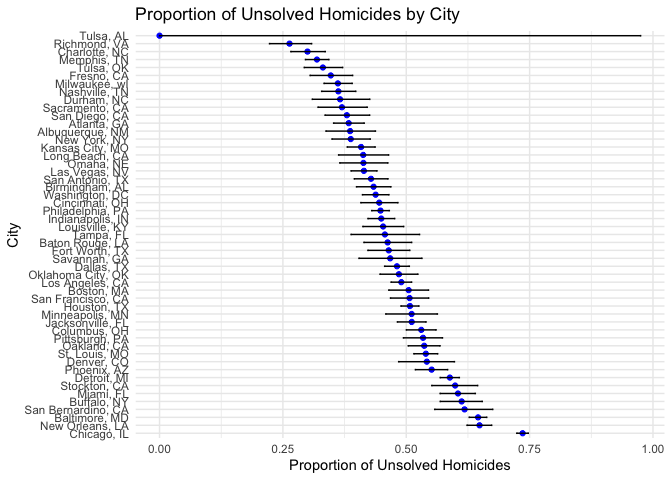

Homework 5 - P8105
================
Kaleb J. Frierson
2024-11-12

- [Introduction](#introduction)
  - [Library Calling](#library-calling)
- [Problem 1](#problem-1)
  - [Random Function](#random-function)
  - [Using Function & Plotting
    Results](#using-function--plotting-results)
- [Problem 2](#problem-2)
  - [Set Elements & Generate Datasets](#set-elements--generate-datasets)
  - [Repetitive Tasks & Plotting](#repetitive-tasks--plotting)
- [Problem 3](#problem-3)
  - [Describe Data](#describe-data)
  - [Function: prop.test](#function-proptest)
  - [Run Function on Cities](#run-function-on-cities)
  - [Plot](#plot)

# Introduction

This is the Iteration Unit homework. This unit includes the components
Writing Functions, Iteration & List columns, and Simulation.

## Library Calling

Here are all libraries used throughout this RMD:

``` r
library(tidyverse)
library(readxl)
library(rvest)
library(broom)
```

# Problem 1

In this problem I will use a `function` to obtain and plot summary
statistics from a `sample`.

## Random Function

Before building the function I practice using `sample` to build a sample
with 100 numbers 1 to 365 to represent days of an entire calendar year:

``` r
n=100
bday_sample = sample(1:365, n, replace = TRUE)

bday_sample
```

    ##   [1]  16 348  76 124 287 189 286 265 203 143  78 108 254 258 289 260 302 135
    ##  [19] 317 189 178 281  17  67 188 198  87 316 337 129 344 270   7  86 151 240
    ##  [37] 112 136 171  39 203 242 107 229  95 106 186  63 275   3  10  34 157 259
    ##  [55] 273 307 135 302 111 112 273 191 176   7 173 222 206 148  33 309  72 100
    ##  [73] 166 157  17  24 307 122 329 195 130  78  44  30  91 206 267 284 182 114
    ##  [91]  31 127 195 301 348 160 295  96 251 123

Here I write a `function` that, for n = 100, randomly draws “birthdays”
for each person; checks whether there are duplicate birthdays in the
group; and returns `TRUE` or `FALSE` based on the result:

``` r
bday_repeats = 
  function(n = 100) {
  
    bday_sample = 
      sample(1:365, n, replace = TRUE)
    
    has_duplicates = 
    any(duplicated(bday_sample))
  
  return(has_duplicates)
}

bday_repeats()     
```

    ## [1] TRUE

``` r
bday_repeats(1)    
```

    ## [1] FALSE

``` r
bday_repeats(32)  
```

    ## [1] TRUE

## Using Function & Plotting Results

Now I run this `function` 10000 times for each group size between 2 and
50. For each group size, I compute the probability that at least two
people in the group will share a birthday by averaging across the 10000
simulation runs. Then I use ggplot to generate a `geom_line` that shows
the probability as a function of group size.

``` r
group_n = 2:50
simulations = 10000

bday_sim_results = tibble(group_size = group_n) |> 
  rowwise() |> 
  mutate(
    probability = mean(replicate(simulations, bday_repeats(group_size)))
  ) |> 
  ungroup()

ggplot(bday_sim_results, aes(x = group_size, y = probability)) +
  geom_line(color = "blue") +
  labs(
    title = "Probability of At Least Two People Sharing a Birthday",
    x = "Group Size",
    y = "Probability"
  ) +
  theme_minimal()
```

<!-- -->

**Comments on Graph:** As group size increases from n = 2 to n = 50, the
probability that someone in the group shares a birthday with someone
else increases.

# Problem 2

In this problem, I will conduct a simulation to explore power in a
one-sample t-test.

## Set Elements & Generate Datasets

Below I generate 5000 datasets from the model:

𝑥∼𝑁𝑜𝑟𝑚𝑎𝑙\[𝜇,𝜎\]

In the `function` I set the following design elements:

Fix 𝑛=30 Fix 𝜎=5 Set 𝜇=0

For each dataset, I save 𝜇̂ and the p-value arising from a test of 𝐻:𝜇=0
using 𝛼=0.05

To obtain the estimate and p-value, I use `broom::tidy` to clean the
output of `t.test`:

``` r
t_simulation = 
  function(mu = 0, n = 30, sigma = 5, simulations) {
  if (!is.numeric(n) || n <= 0) stop("Sample size 'n' must be a positive number.")
  if (!is.numeric(sigma) || sigma <= 0) stop("Standard deviation 'sigma' must be a positive number.")
  if (!is.numeric(simulations) || simulations <= 0) stop("Number of simulations must be a positive number.")
  
  map_dfr(1:simulations, ~ { 
    x = rnorm(n, mean = mu, sd = sigma)
    test_result = t.test(x, mu = 0)
    tidy_res = tidy(test_result)
    
    tibble( 
      mu_true = mu, 
      mu_hat = tidy_res$estimate, 
      p_value = tidy_res$p.value
    )
  })
}

test_result = 
  t_simulation(mu = 0, n = 30, sigma = 5, simulations = 5000)

head(test_result)
```

    ## # A tibble: 6 × 3
    ##   mu_true mu_hat p_value
    ##     <dbl>  <dbl>   <dbl>
    ## 1       0  1.57   0.0621
    ## 2       0 -0.351  0.692 
    ## 3       0 -0.727  0.434 
    ## 4       0 -0.776  0.505 
    ## 5       0 -0.365  0.684 
    ## 6       0 -0.362  0.716

## Repetitive Tasks & Plotting

Here I repeat the above for 𝜇={1,2,3,4,5,6}:

``` r
mu_values = 1:6

repeated = 
  map_dfr(mu_values, ~ t_simulation(.x, n=30, sigma=5, simulations=5000)) |> 
  unnest(cols = p_value)

head(repeated)
```

    ## # A tibble: 6 × 3
    ##   mu_true  mu_hat  p_value
    ##     <int>   <dbl>    <dbl>
    ## 1       1  1.78   0.0943  
    ## 2       1  0.0396 0.962   
    ## 3       1  1.11   0.264   
    ## 4       1 -1.26   0.225   
    ## 5       1  2.24   0.0213  
    ## 6       1  3.50   0.000606

Here I generate a plot using `gglpot` showing power on the y axis and
the true value of 𝜇 on the x axis:

``` r
power_results = 
  repeated |> 
  group_by(mu_true) |> 
  summarize(power = mean(p_value < 0.05), .groups = "drop") 

power_plot = 
power_results |> 
ggplot(aes(x = mu_true, y = power)) +
  geom_point(color = "goldenrod") +
  geom_line(color = "royalblue") +
  labs(
    title = "Power of the Test vs. True Value of µ",
    x = "True Value of µ",
    y = "Power"
  ) +
  theme_minimal()

power_plot
```

<!-- -->

**Describe the association between effect size and power**: Power
increases as the true mean, a proxy for effect size, increases.

Here I make a plot showing the average estimate of 𝜇̂ on the y axis and
the true value of 𝜇on the x axis. I then overlay the average estimate of
𝜇̂ only in samples for which the null was rejected on the y axis and the
true value of 𝜇 on the x axis:

``` r
average_results = 
  repeated |> 
  group_by(mu_true) |> 
  summarize(
    avg_mu_hat = mean(mu_hat),            
    avg_mu_hat_rejected = mean(mu_hat[p_value < 0.05])
  )

plot = 
  average_results |> 
  ggplot(aes(x = mu_true)) +
  geom_line(
    aes(y = avg_mu_hat, color = "Overall Avg µ̂"), 
            linetype = "dashed", linewidth = 1) +
  geom_line(
    aes(y = avg_mu_hat_rejected, color ="Avg µ̂ (Null   Rejected)"), size = 1) +
  labs(
    title = "Average Estimate of µ̂ vs True Value of µ",
    x = "True Value of µ",
    y = "Average Estimate of µ̂", 
    color = "Legend"
  ) +
  theme_minimal() 
```

    ## Warning: Using `size` aesthetic for lines was deprecated in ggplot2 3.4.0.
    ## ℹ Please use `linewidth` instead.
    ## This warning is displayed once every 8 hours.
    ## Call `lifecycle::last_lifecycle_warnings()` to see where this warning was
    ## generated.

``` r
plot
```

<!-- -->

**Is the sample average of 𝜇̂ across tests for which the null is rejected
approximately equal to the true value of 𝜇? Why or why not?**

Not when true value of mu is lower than about 3. This makes sense
because we showed earlier that power (correctly rejecting a null
hypothesis) increases with effect size.

# Problem 3

## Describe Data

Here I use `mutate` to create a city_state variable. Then I `summarize`
within cities to obtain the total number of homicides and the number of
unsolved homicides (those for which the disposition is “Closed without
arrest” or “Open/No arrest”):

``` r
murder = 
  read.csv("local data/homicide-data.csv", na = c("NA", "", ".")) |> 
  mutate(
    city_state = str_c(city, ", ", state),
    unsolved = disposition %in% c("Closed without arrest", "Open/No arrest")
  ) |> janitor::clean_names()
  
homicide_summary = 
  murder |>   
  group_by(city_state) |> 
  summarize(
    total_homicides = n(),
    unsolved_homicides = sum(unsolved),
    .groups = "drop"
  )

knitr::kable(homicide_summary)
```

| city_state         | total_homicides | unsolved_homicides |
|:-------------------|----------------:|-------------------:|
| Albuquerque, NM    |             378 |                146 |
| Atlanta, GA        |             973 |                373 |
| Baltimore, MD      |            2827 |               1825 |
| Baton Rouge, LA    |             424 |                196 |
| Birmingham, AL     |             800 |                347 |
| Boston, MA         |             614 |                310 |
| Buffalo, NY        |             521 |                319 |
| Charlotte, NC      |             687 |                206 |
| Chicago, IL        |            5535 |               4073 |
| Cincinnati, OH     |             694 |                309 |
| Columbus, OH       |            1084 |                575 |
| Dallas, TX         |            1567 |                754 |
| Denver, CO         |             312 |                169 |
| Detroit, MI        |            2519 |               1482 |
| Durham, NC         |             276 |                101 |
| Fort Worth, TX     |             549 |                255 |
| Fresno, CA         |             487 |                169 |
| Houston, TX        |            2942 |               1493 |
| Indianapolis, IN   |            1322 |                594 |
| Jacksonville, FL   |            1168 |                597 |
| Kansas City, MO    |            1190 |                486 |
| Las Vegas, NV      |            1381 |                572 |
| Long Beach, CA     |             378 |                156 |
| Los Angeles, CA    |            2257 |               1106 |
| Louisville, KY     |             576 |                261 |
| Memphis, TN        |            1514 |                483 |
| Miami, FL          |             744 |                450 |
| Milwaukee, wI      |            1115 |                403 |
| Minneapolis, MN    |             366 |                187 |
| Nashville, TN      |             767 |                278 |
| New Orleans, LA    |            1434 |                930 |
| New York, NY       |             627 |                243 |
| Oakland, CA        |             947 |                508 |
| Oklahoma City, OK  |             672 |                326 |
| Omaha, NE          |             409 |                169 |
| Philadelphia, PA   |            3037 |               1360 |
| Phoenix, AZ        |             914 |                504 |
| Pittsburgh, PA     |             631 |                337 |
| Richmond, VA       |             429 |                113 |
| Sacramento, CA     |             376 |                139 |
| San Antonio, TX    |             833 |                357 |
| San Bernardino, CA |             275 |                170 |
| San Diego, CA      |             461 |                175 |
| San Francisco, CA  |             663 |                336 |
| Savannah, GA       |             246 |                115 |
| St. Louis, MO      |            1677 |                905 |
| Stockton, CA       |             444 |                266 |
| Tampa, FL          |             208 |                 95 |
| Tulsa, AL          |               1 |                  0 |
| Tulsa, OK          |             583 |                193 |
| Washington, DC     |            1345 |                589 |

**Describe the raw data:** There are `r nrow(murder)` rows and 14
columns in the `murder` dataset. Chicago, IL has the most homicides in
the dataset: 5535 with a shocking 4073 of them unsolved.

## Function: prop.test

For the city of Baltimore, MD, I use the `prop.test` function to
estimate the proportion of homicides that are unsolved; I save the
output of `prop.test` as an R object called `baltimore_test`, and then
apply `broom::tidy` to that object and pull the estimated proportion and
confidence intervals from the resulting tidy dataframe.

``` r
baltimore_data = 
  homicide_summary |> 
  filter(city_state == "Baltimore, MD")

baltimore_test = prop.test(
  x = baltimore_data$unsolved_homicides,
  n = baltimore_data$total_homicides
)

baltimore_results = 
  tidy(baltimore_test) |> 
  select(estimate, conf.low, conf.high)

baltimore_results
```

    ## # A tibble: 1 × 3
    ##   estimate conf.low conf.high
    ##      <dbl>    <dbl>     <dbl>
    ## 1    0.646    0.628     0.663

## Run Function on Cities

Here I run `prop.test` for each of the cities in the dataset and extract
both the proportion of unsolved homicides and the confidence interval
for each. I do this within a “tidy” pipeline, making use of
`purrr::map2`. Probably above the needs of this class, I set criteria
such that `binom.test` is run on those with less than 5 values as to not
violate assumptions of `prop.test`. Estimated proportions and CIs are
provided for each city:

``` r
city_results = 
  homicide_summary |> 
  mutate(
    prop_test = map2(
      unsolved_homicides, 
      total_homicides, 
      ~ if (.x < 5 | (.y - .x) < 5) {
          tidy(binom.test(x = .x, n = .y))
        } else {
          tidy(prop.test(x = .x, n = .y))
        }
    )
  ) |> 
  unnest(prop_test) |> 
  select(city_state, estimate, conf.low, conf.high)

head(city_results)
```

    ## # A tibble: 6 × 4
    ##   city_state      estimate conf.low conf.high
    ##   <chr>              <dbl>    <dbl>     <dbl>
    ## 1 Albuquerque, NM    0.386    0.337     0.438
    ## 2 Atlanta, GA        0.383    0.353     0.415
    ## 3 Baltimore, MD      0.646    0.628     0.663
    ## 4 Baton Rouge, LA    0.462    0.414     0.511
    ## 5 Birmingham, AL     0.434    0.399     0.469
    ## 6 Boston, MA         0.505    0.465     0.545

## Plot

Here I create a plot showing estimates and CIs for each city.
`geom_errorbar` allowed me to add error bars based on the upper and
lower limits. Cities were organized according to the proportion of
unsolved homicides using `arrange`. For best viewership, see the knitted
document.

``` r
city_results = 
  city_results |> 
  arrange(desc(estimate)) |> 
  mutate(city_state = factor(city_state, levels = city_state))

city_results |> 
ggplot(aes(x = city_state, y = estimate)) +
  geom_point(color = "blue") +
  geom_errorbar(
    aes(ymin = conf.low, ymax = conf.high), width = 0.2) +
  coord_flip() +
  labs(
    title = "Proportion of Unsolved Homicides by City",
    x = "City",
    y = "Proportion of Unsolved Homicides"
  ) +
  theme_minimal()
```

<!-- -->
