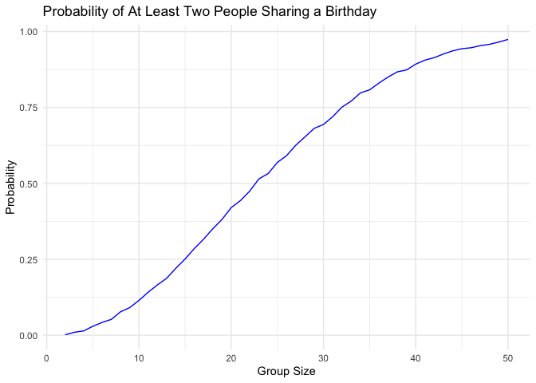
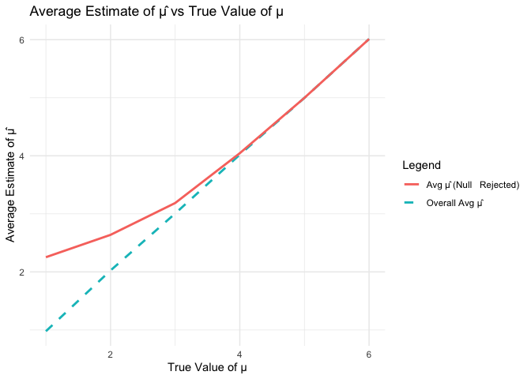

Homework 5 - P8105
================
Kaleb J. Frierson
2024-11-12

- [Introduction](#introduction)
  - [Library Calling](#library-calling)
- [Problem 1](#problem-1)
  - [Random Function](#random-function)
  - [Using Function & Plotting
    Results](#using-function--plotting-results)
- [Problem 2](#problem-2)
  - [Set Elements & Generate Datasets](#set-elements--generate-datasets)
  - [Repetitive Tasks & Plotting](#repetitive-tasks--plotting)
- [Problem 3](#problem-3)
  - [Describe Data](#describe-data)
  - [Function: prop.test](#function-proptest)
  - [Run Function on Cities](#run-function-on-cities)
  - [Plot](#plot)

# Introduction

This homework is associated with the Iteration Unit. This unit includes
the components Writing Functions, Iteration & List columns, and
Simulation.

## Library Calling

Here are all libraries used throughout this RMD:

``` r
library(tidyverse)
library(readxl)
library(rvest)
library(broom)
```

# Problem 1

## Random Function

Suppose you put n people in a room, and want to know the probability
that at least two people share a birthday. For simplicity, we’ll assume
there are no leap years (i.e. there are only 365 days) and that
birthdays are uniformly distributed over the year (which is actually not
the case).

Write a function that, for a fixed group size, randomly draws
“birthdays” for each person; checks whether there are duplicate
birthdays in the group; and returns TRUE or FALSE based on the result.

``` r
n = 100
bday_sample = sample(1:365, n, replace = TRUE)

bday_sample
```

    ##   [1] 251 107 206 363 126 260  81 333 247 197  64  78 187 176 352 210 309  89
    ##  [19]  26  62 193 115 353   3 330 287 119 195 194 118 203   3  72 228 272 125
    ##  [37] 296  21 102 321 353 357 337 241 306 351 140 260  32 342 156 216 302 274
    ##  [55] 178 334  49 234  84 301 264 197  31 347  70 100 114 323  16 229 157 105
    ##  [73] 279 292 236  78  16 157 260 330  65 164 268 145 236 155 207 346   3 124
    ##  [91]  96 293  10 131  50  75 272 301  85  97

``` r
bday_repeats = 
  function(n = 100) {
  
    bday_sample = 
      sample(1:365, n, replace = TRUE)
    
    has_duplicates = 
    any(duplicated(bday_sample))
  
  return(has_duplicates)
}

bday_repeats()     
```

    ## [1] TRUE

``` r
bday_repeats(1)    
```

    ## [1] FALSE

``` r
bday_repeats(32)  
```

    ## [1] FALSE

## Using Function & Plotting Results

Next, run this function 10000 times for each group size between 2 and
50. For each group size, compute the probability that at least two
people in the group will share a birthday by averaging across the 10000
simulation runs. Make a plot showing the probability as a function of
group size, and comment on your results.

``` r
group_n = 2:50
simulations = 10000

bday_sim_results = tibble(group_size = group_n) |> 
  rowwise() |> 
  mutate(
    probability = mean(replicate(simulations, bday_repeats(group_size)))
  ) |> 
  ungroup()

ggplot(bday_sim_results, aes(x = group_size, y = probability)) +
  geom_line(color = "blue") +
  labs(
    title = "Probability of At Least Two People Sharing a Birthday",
    x = "Group Size",
    y = "Probability"
  ) +
  theme_minimal()
```

<!-- -->
**Comments on Graph:** As group size increases from n = 2 to n = 50, the
probability that someone in the group shares a birthday with someone
else increases.

# Problem 2

When designing an experiment or analysis, a common question is whether
it is likely that a true effect will be detected – put differently,
whether a false null hypothesis will be rejected. The probability that a
false null hypothesis is rejected is referred to as power, and it
depends on several factors, including: the sample size; the effect size;
and the error variance. In this problem, you will conduct a simulation
to explore power in a one-sample t-test.

## Set Elements & Generate Datasets

Generate 5000 datasets from the model

𝑥∼𝑁𝑜𝑟𝑚𝑎𝑙\[𝜇,𝜎\]

First set the following design elements:

Fix 𝑛=30 Fix 𝜎=5 Set 𝜇=0

For each dataset, save 𝜇̂ and the p-value arising from a test of 𝐻:𝜇=0
using 𝛼=0.05

Hint: to obtain the estimate and p-value, use broom::tidy to clean the
output of t.test.

``` r
t_simulation = 
  function(mu = 0, n = 30, sigma = 5, simulations) {
  if (!is.numeric(n) || n <= 0) stop("Sample size 'n' must be a positive number.")
  if (!is.numeric(sigma) || sigma <= 0) stop("Standard deviation 'sigma' must be a positive number.")
  if (!is.numeric(simulations) || simulations <= 0) stop("Number of simulations must be a positive number.")
  
  map_dfr(1:simulations, ~ { 
    x = rnorm(n, mean = mu, sd = sigma)
    test_result = t.test(x, mu = 0)
    tidy_res = tidy(test_result)
    
    tibble( 
      mu_true = mu, 
      mu_hat = tidy_res$estimate, 
      p_value = tidy_res$p.value
    )
  })
}

test_result = 
  t_simulation(mu = 0, n = 30, sigma = 5, simulations = 5000)

head(test_result)
```

    ## # A tibble: 6 × 3
    ##   mu_true  mu_hat p_value
    ##     <dbl>   <dbl>   <dbl>
    ## 1       0  0.248    0.785
    ## 2       0 -0.299    0.759
    ## 3       0 -0.378    0.658
    ## 4       0 -0.919    0.256
    ## 5       0  0.620    0.389
    ## 6       0 -0.0891   0.908

## Repetitive Tasks & Plotting

Repeat the above for 𝜇={1,2,3,4,5,6}, and make a plot showing the
proportion of times the null was rejected (the power of the test) on the
y axis and the true value of 𝜇 on the x axis.

``` r
mu_values = 1:6

repeated = 
  map_dfr(mu_values, ~ t_simulation(.x, n=30, sigma=5, simulations=5000)) |> 
  unnest(cols = p_value)

head(repeated)
```

    ## # A tibble: 6 × 3
    ##   mu_true mu_hat p_value
    ##     <int>  <dbl>   <dbl>
    ## 1       1 -0.429  0.662 
    ## 2       1  0.390  0.636 
    ## 3       1  1.88   0.0522
    ## 4       1  0.663  0.393 
    ## 5       1 -0.303  0.749 
    ## 6       1  0.432  0.649

``` r
power_results = 
  repeated |> 
  group_by(mu_true) |> 
  summarize(power = mean(p_value < 0.05), .groups = "drop") 

power_plot = 
power_results |> 
ggplot(aes(x = mu_true, y = power)) +
  geom_point(color = "goldenrod") +
  geom_line(color = "royalblue") +
  labs(
    title = "Power of the Test vs. True Value of µ",
    x = "True Value of µ",
    y = "Power"
  ) +
  theme_minimal()

power_plot
```

<!-- -->
**Describe the association between effect size and power**: Power
increases as the true mean, a proxy for effect size, increases.

Make a plot showing the average estimate of 𝜇̂ on the y axis and the true
value of 𝜇on the x axis. Make a second plot (or overlay on the first)
the average estimate of 𝜇̂ only in samples for which the null was
rejected on the y axis and the true value of 𝜇 on the x axis.

``` r
average_results = 
  repeated |> 
  group_by(mu_true) |> 
  summarize(
    avg_mu_hat = mean(mu_hat),            
    avg_mu_hat_rejected = mean(mu_hat[p_value < 0.05])
  )

plot = 
  average_results |> 
  ggplot(aes(x = mu_true)) +
  geom_line(
    aes(y = avg_mu_hat, color = "Overall Avg µ̂"), 
            linetype = "dashed", linewidth = 1) +
  geom_line(
    aes(y = avg_mu_hat_rejected, color ="Avg µ̂ (Null   Rejected)"), size = 1) +
  labs(
    title = "Average Estimate of µ̂ vs True Value of µ",
    x = "True Value of µ",
    y = "Average Estimate of µ̂", 
    color = "Legend"
  ) +
  theme_minimal() 
```

    ## Warning: Using `size` aesthetic for lines was deprecated in ggplot2 3.4.0.
    ## ℹ Please use `linewidth` instead.
    ## This warning is displayed once every 8 hours.
    ## Call `lifecycle::last_lifecycle_warnings()` to see where this warning was
    ## generated.

``` r
plot
```

<!-- -->
**Is the sample average of 𝜇̂ across tests for which the null is rejected
approximately equal to the true value of 𝜇? Why or why not?**

# Problem 3

The Washington Post has gathered data on homicides in 50 large U.S.
cities and made the data available through a GitHub repository here. You
can read their accompanying article here.

## Describe Data

Describe the raw data. Create a city_state variable (e.g. “Baltimore,
MD”) and then summarize within cities to obtain the total number of
homicides and the number of unsolved homicides (those for which the
disposition is “Closed without arrest” or “Open/No arrest”).

## Function: prop.test

For the city of Baltimore, MD, use the prop.test function to estimate
the proportion of homicides that are unsolved; save the output of
prop.test as an R object, apply the broom::tidy to this object and pull
the estimated proportion and confidence intervals from the resulting
tidy dataframe.

## Run Function on Cities

Now run prop.test for each of the cities in your dataset, and extract
both the proportion of unsolved homicides and the confidence interval
for each. Do this within a “tidy” pipeline, making use of purrr::map,
purrr::map2, list columns and unnest as necessary to create a tidy
dataframe with estimated proportions and CIs for each city.

## Plot

Create a plot that shows the estimates and CIs for each city – check out
geom_errorbar for a way to add error bars based on the upper and lower
limits. Organize cities according to the proportion of unsolved
homicides.
