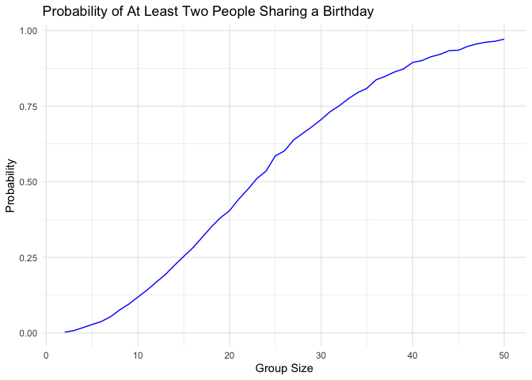

Homework 5 - P8105
================
Kaleb J. Frierson
2024-11-12

- [Introduction](#introduction)
  - [Library Calling](#library-calling)
- [Problem 1](#problem-1)
  - [Random Function](#random-function)
  - [Using Function & Plotting
    Results](#using-function--plotting-results)
- [Problem 2](#problem-2)
  - [Set Elements](#set-elements)
  - [Generate Datasets](#generate-datasets)
  - [Repetitive Tasks & Plotting](#repetitive-tasks--plotting)
- [Problem 3](#problem-3)
  - [Describe Data](#describe-data)
  - [Function: prop.test](#function-proptest)
  - [Run Function on Cities](#run-function-on-cities)
  - [Plot](#plot)

# Introduction

This homework is associated with the Iteration Unit. This unit includes
the components Writing Functions, Iteration & List columns, and
Simulation.

## Library Calling

Here are all libraries used throughout this RMD:

``` r
library(tidyverse)
library(readxl)
library(rvest)
```

# Problem 1

## Random Function

Suppose you put n people in a room, and want to know the probability
that at least two people share a birthday. For simplicity, we’ll assume
there are no leap years (i.e. there are only 365 days) and that
birthdays are uniformly distributed over the year (which is actually not
the case).

Write a function that, for a fixed group size, randomly draws
“birthdays” for each person; checks whether there are duplicate
birthdays in the group; and returns TRUE or FALSE based on the result.

``` r
n = 100
bday_sample = sample(1:365, n, replace = TRUE)

bday_sample
```

    ##   [1] 348   6 108 294  43 271  29 154 183 102 346 150  46  55 159  99 199 265
    ##  [19]  72 129 349 121  92 137  97 221 356 249 133 163 326 197 191 337 121 154
    ##  [37] 129 210 259  35 114 360 277 160  57  76 331  22 157  48 111 107   8 263
    ##  [55] 323  71 337  99 259  56 265 360 258 177 214  83 135 170  90  46  37  47
    ##  [73]  90 259 110 206 106  16 293 121 280 311 263  22 322 222   6 265 163  59
    ##  [91] 104  53  39  22  57 221 338 239 354 304

``` r
bday_repeats = 
  function(n = 100) {
  
    bday_sample = 
      sample(1:365, n, replace = TRUE)
    
    has_duplicates = 
    any(duplicated(bday_sample))
  
  return(has_duplicates)
}

bday_repeats()     
```

    ## [1] TRUE

``` r
bday_repeats(1)    
```

    ## [1] FALSE

``` r
bday_repeats(32)  
```

    ## [1] FALSE

## Using Function & Plotting Results

Next, run this function 10000 times for each group size between 2 and
50. For each group size, compute the probability that at least two
people in the group will share a birthday by averaging across the 10000
simulation runs. Make a plot showing the probability as a function of
group size, and comment on your results.

``` r
group_n = 2:50
simulations = 10000

bday_sim_results = tibble(group_size = group_n) |> 
  rowwise() |> 
  mutate(
    probability = mean(replicate(simulations, bday_repeats(group_size)))
  ) |> 
  ungroup()

ggplot(bday_sim_results, aes(x = group_size, y = probability)) +
  geom_line(color = "blue") +
  labs(
    title = "Probability of At Least Two People Sharing a Birthday",
    x = "Group Size",
    y = "Probability"
  ) +
  theme_minimal()
```

<!-- -->
**Comments on Graph:** As group size increases from n = 2 to n = 50, the
probability that someone in the group shares a birthday with someone
else increases.

# Problem 2

When designing an experiment or analysis, a common question is whether
it is likely that a true effect will be detected – put differently,
whether a false null hypothesis will be rejected. The probability that a
false null hypothesis is rejected is referred to as power, and it
depends on several factors, including: the sample size; the effect size;
and the error variance. In this problem, you will conduct a simulation
to explore power in a one-sample t-test.

## Set Elements

First set the following design elements:

Fix 𝑛=30 Fix 𝜎=5 Set 𝜇=0

## Generate Datasets

Generate 5000 datasets from the model

𝑥∼𝑁𝑜𝑟𝑚𝑎𝑙\[𝜇,𝜎\]

For each dataset, save 𝜇̂ and the p-value arising from a test of 𝐻:𝜇=0
using 𝛼=0.05

Hint: to obtain the estimate and p-value, use broom::tidy to clean the
output of t.test.

## Repetitive Tasks & Plotting

Repeat the above for 𝜇={1,2,3,4,5,6}, and complete the following:

Make a plot showing the proportion of times the null was rejected (the
power of the test) on the y axis and the true value of 𝜇 on the x axis.
Describe the association between effect size and power.

Make a plot showing the average estimate of 𝜇̂ on the y axis and the true
value of 𝜇 on the x axis. Make a second plot (or overlay on the first)
the average estimate of 𝜇̂ only in samples for which the null was
rejected on the y axis and the true value of 𝜇 on the x axis. Is the
sample average of 𝜇̂ across tests for which the null is rejected
approximately equal to the true value of 𝜇? Why or why not?

# Problem 3

The Washington Post has gathered data on homicides in 50 large U.S.
cities and made the data available through a GitHub repository here. You
can read their accompanying article here.

## Describe Data

Describe the raw data. Create a city_state variable (e.g. “Baltimore,
MD”) and then summarize within cities to obtain the total number of
homicides and the number of unsolved homicides (those for which the
disposition is “Closed without arrest” or “Open/No arrest”).

## Function: prop.test

For the city of Baltimore, MD, use the prop.test function to estimate
the proportion of homicides that are unsolved; save the output of
prop.test as an R object, apply the broom::tidy to this object and pull
the estimated proportion and confidence intervals from the resulting
tidy dataframe.

## Run Function on Cities

Now run prop.test for each of the cities in your dataset, and extract
both the proportion of unsolved homicides and the confidence interval
for each. Do this within a “tidy” pipeline, making use of purrr::map,
purrr::map2, list columns and unnest as necessary to create a tidy
dataframe with estimated proportions and CIs for each city.

## Plot

Create a plot that shows the estimates and CIs for each city – check out
geom_errorbar for a way to add error bars based on the upper and lower
limits. Organize cities according to the proportion of unsolved
homicides.
